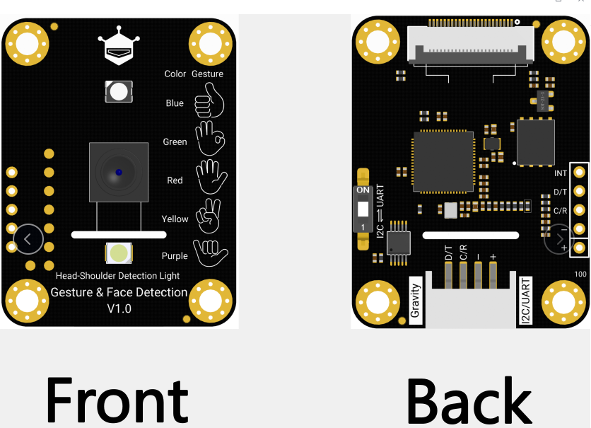

# DFRobot_GestureFaceDetection

* [中文版](./README_CN.md)

GestureFaceDetection is a sensor capable of tracking human head and shoulders and detecting five types of gestures from up to 3 meters away.



## Product Link（https://www.dfrobot.com/product-2914.html)
    SEN0626:Gesture Sensor 
## Table of Contents

* [Summary](#summary)
* [Installation](#installation)
* [Methods](#methods)
* [Compatibility](#compatibility)
* [History](#history)
* [Credits](#credits)

## Summary

Provide an Arduino library to control 

## Installation

To use this library, first download it to Raspberry Pi and download smbus2

```
pip install smbus2
pip3 install smbus2
```

then open the use case folder. To execute a use case demox.py, enter python demox.py in the command line. For example, to execute the getypid_vid. py use case, you need to input:

```
python get_pid_vid.py
```

## Methods
```python
  
    def read_pid(self):
    '''
      @brief Get the device PID
      @return Returns the device PID
    '''

    def read_vid(self):
    '''
      @brief Get the device VID
      @return Returns the device VID
    '''

    def get_face_number(self):
    '''
      @brief Get the number of detected faces
      @return Returns the number of detected faces
    '''

    def config_uart(self, baud, parity, stop_bit):
    '''
      @brief Configure UART
      @param baud Baud rate
      @param parity Parity bit
      @param stop_bit Stop bits
    '''

    def get_face_location_x(self):
    '''
      @brief Get the X location of the face
      @return Returns the X location
    '''

    def get_face_location_y(self):
    '''
      @brief Get the Y location of the face
      @return Returns the Y location
    '''

    def get_face_score(self):
    '''
      @brief Get the face score
      @return Returns the face score
    '''

    def get_gesture_type(self):
    '''
      @brief Get the gesture type
             - 1: LIKE (👍) - blue
             - 2: OK (👌) - green
             - 3: STOP (🤚) - red
             - 4: YES (✌) - yellow
             - 5: SIX (🤙) - purple
      @return Returns the gesture type
    '''

    def get_gesture_score(self):
    '''
      @brief Get the gesture score
      @return Returns the gesture score
    '''

    def set_face_detect_thres(self, score):
    '''
      @brief Set the face detection threshold
      @n Sets the threshold for face detection (0-100). Default is 60%
      @param score Threshold score
    '''

    def set_detect_thres(self, x):
    '''
      @brief Set the x-range for face detection
      @n Sets the threshold for detecting the X coordinate (0-100). Default is 60%.
      @param x Threshold value
    '''

    def set_gesture_detect_thres(self, score):
    '''
      @brief Set the gesture detection threshold
      @n Sets the threshold for gesture detection (0-100). Default is 60%.
      @param score Threshold score
    '''

    def get_face_detect_thres(self):
    '''
      @brief Get the face detection threshold
      @n Get the threshold for face detection (0-100). Default is 60%
      @return Return the face detection threshold
    '''

    def get_detect_thres(self):
    '''
      @brief Get the x-range for face detection
      @n Get the threshold for detecting the X coordinate (0-100). Default is 60%.
      @return Return the x-range for face detection
    '''

    def get_gesture_detect_thres(self):
    '''
      @brief Get the gesture detection threshold
      @n Get the threshold for gesture detection (0-100). Default is 60%.
      @return Return the threshold for gesture detection
    '''

    def set_addr(self, addr):
    '''
      @brief Set the device address
      @param addr Address to set
    '''
```

## Compatibility

| MCU         | Work Well | Work Wrong  | Untested | Remarks |
| ------------ | :--: | :----: | :----: | :--: |
| RaspberryPi4 |  √   |        |        |      |

* Python version 

| Python  | Work Well | Work Wrong | Untested | Remarks |
| ------- | :--: | :----: | :----: | ---- |
| Python2 |  √   |        |        |      |
| Python3 |  √   |        |        |      |
## History 

- 2025/03/17 - Version 1.0.0 released.

## Credits

Written by thdyyl(yuanlong.yu@dfrobot.com), 2025.03.17 (Welcome to our [website](https://www.dfrobot.com/))


